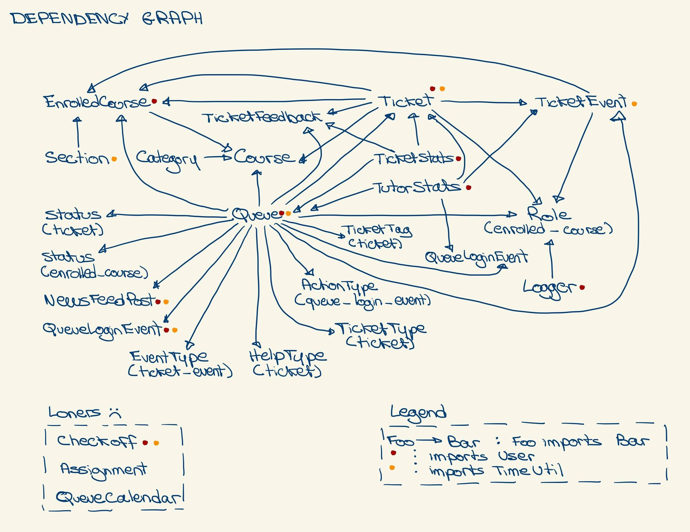

# App Architecture

### Overview
`Chessboard` is a backend service containing the API middleware and the DAL for the Autograder website.
It is a <a href="https://flask.palletsprojects.com/en/1.1.x/" target="_blank">Flask application</a> running using
<a href="https://docs.python.org/3/index.html" target="_blank">Python 3</a>. It responds to requests via HTTPS, and responds with JSON. It is Dockerized and runs using `docker-compose`
to serve for easy setup and configuration.

### Repository Layout
The `data` directory contains a blank starter `SQL` file for the DB, a `Dockerfile` for setup, and a `backup` script run
as a cronjob on the server for creating database dumps once per day.

In the directory, outside of any subdirectories, there's a file called `runner.py`. You'll never have to touch this. All this
file does is fire up the CLI for the app so that it can be run more easily from Docker.

The main app lives under the `project` directory. In here are two more directories (`src` and `tests`), as well as a few Python
files. `config.py` contains the configuration settings pulled in from the Docker container after startup. `setup.py` contains the setup
for the Flask application itself and initializes the DB connector and other plugins. `__init__.py` contains the route configuration
for the app as well as some functions needed by the login manager.

Let's talk some more about `__init__.py`. You can see a section which imports a bunch of things with the naming convention `<something>_api_bp`. These are <a href="https://flask.palletsprojects.com/en/1.1.x/blueprints/#blueprints" target="_blank">Flask Blueprints</a>, which is a way of separating up your Flask app into separate files and linking them together.

When you work on a new API, you have to come here to `__init__.py`, import the blueprint, then link it to the Flask app. Pretty much,
just follow the code you see in the file. The only thing of note is that the `url_prefix` field inside of the `register_blueprint` function
makes it so that in your code later you don't have to type the full URL, just the ending part of it.

Moving on, under the `src` directory live 4 more directories: `api`, `models`, `security`, and `utils`. The `api` and `models` directories have files that have the same name, but serve different purposes. The `api` files (like `api/user.py`) contain the API routes and functions
used from the frontend as well as other files in the project. Some things to note in these files is that they all use the
<a href="https://flask-cors.readthedocs.io/en/latest/" target="_blank">Flask CORS</a> library to be able to serve as a functional API,
and not doing so will make it so that the front end can't actually use your routes for anything meaningful due to the <a href="https://en.wikipedia.org/wiki/Same-origin_policy" target="_blank">Same-origin policy (take CSE 127 for a non-wikipedia explanation)</a>. You also
need to create a blueprint in this file and register all routes under it (look at one of the files to see how). Note that for status codes,
we always return the base code (e.g. 200, 300, 400) and contain the reason for the code in the body of the JSON response.

The `models` directory is where we use <a href="https://flask-sqlalchemy.palletsprojects.com/en/2.x/" target="_blank">Flask_SQLAlchemy</a> to
communicate with our database. Please note that the `api` files should import `models` files, and not vice-versa. Each file contains a class
which is a one-to-one mapping of one of our database tables. All classes should implement their own version of a `to_json` function which
returns all of the relevant fields as part of a dictionary to make the API cleaner.

There is a complex web of imports to ensure that no circular dependencies are found, it looks like this:

Yeah, it's complex, but as long as you don't introduce an import into that graph that causes a cycle we'll be fine.

The `security` directory contains files pertaining to secure functions. `password.py` contains the setup for the password hasher, and
can be easily upgraded to change the hash as well as to deprecate certain passwords. `roles.py` contains the setup for the role configuration
system used throughout the backend.

The `utils` directory contains a hodgepodge of utility files, ranging from the logging system (`logger.py`) to the emailer (`mailer.py`) to our password generation function to the files that interact with `cron`. The most important stuff here would be the logger, emailer, `time.py` (contains time utility functions), `ticket_statistics.py`, and `tutor_stats.py`. The latter two files are used to get extra info for professors. Lastly, the `exceptions.py` file contains custom exceptions raised throughout the backend. At the moment, that's just one; however, this can be easily extended so that we have a whole suite of custom exceptions to raise/catch everywhere.

Lastly, `tests` contains unit tests. That was pretty self explanatory.

### Docker
The app, as mentioned before, uses Docker and `docker-compose` to make installation and setup a breeze. The relevant files
for this live inside the main `chessboard` directory. The `.dockerignore` acts just like a `.gitignore`, except it specifies which
files and directories docker shouldn't copy over into the image. The `Dockerfile` is nicely commented explaining what each thing
does, and the `docker-compose.yml` file is pretty easy to understand as-is. The only things that haven't been accounted for are the
`requirements.txt` file (where python packages should be added by name for installation) and the file `entrypoint.sh`.

The `entrypoint.sh` script really serves to ensure that the image with the database is up and running before the image with the Flask
app is because if this isn't the case, the Flask app will have errors.

### Final Notes/Rules to Follow

That's it! If you got this far, you now know the rough layout and setup of the app.
Here are some final rules to follow:

1. Annotate your function parameter types and return value types!
2. _**Do not**_ edit `config.py`, `setup.py`, or any part of `__init__.py` other than the parts in between the edit lines unless otherwise told to by one of the lead devs.
3. Use the logger, but don't overuse it. Put the appropriate log level on the appropriate message.
4. Keep your code <a href="https://hub.packtpub.com/write-python-code-or-pythonic-code/" target="_blank">pythonic</a>. This isn't C++ nor is it Java. Open up a python interpreter and type `import this` to get an idea of how to be pythonic.
5. <a href="https://realpython.com/python-f-strings/" target="_blank">f strings</a> are good, use them.
6. Use `@staticmethod` and `@classmethod` annotations accordingly. This is relevant for the `models` directory; read <a href="https://stackabuse.com/pythons-classmethod-and-staticmethod-explained/" target="_blank"> here</a> for more information.
7. _**Never**_ import the logger class into _any_ classes in the `models` directory! This can cause circular dependencies. Instead, add logging to the `api` classes.
8. Don't be afraid to ask questions!

---
[go back](/chessboard)
