# Getting Started with Development

## PyCharm Debugger Setup
Follow the steps below to setup `chessboard` with a configuration to use Pycharm's Debug tool for Python, which allows you to set breakpoints, watch variables, etc.

#### Installing Pycharm

1. Make sure you have the [JetBrains Product Pack for Students](https://www.jetbrains.com/community/education/#students).
2. Download the Professional version of [PyCharm 2020.2.2](https://www.jetbrains.com/pycharm/download/#section=mac). (Older versions may not work!)
3. Follow the installation steps for PyCharm.
4. Open the `chessboard` directory in PyCharm.

#### Interpreter Setup

First, we need to setup the Python Interpreter to use the Docker Image set up on starting the project.

5. Select `Pycharm` &rarr; `Preferences`.
   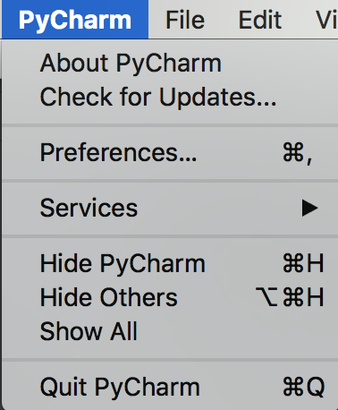
6. Select `Project:chessboard` &rarr; `Python Interpreter`.
7. Click the gear icon and select `Add`.
   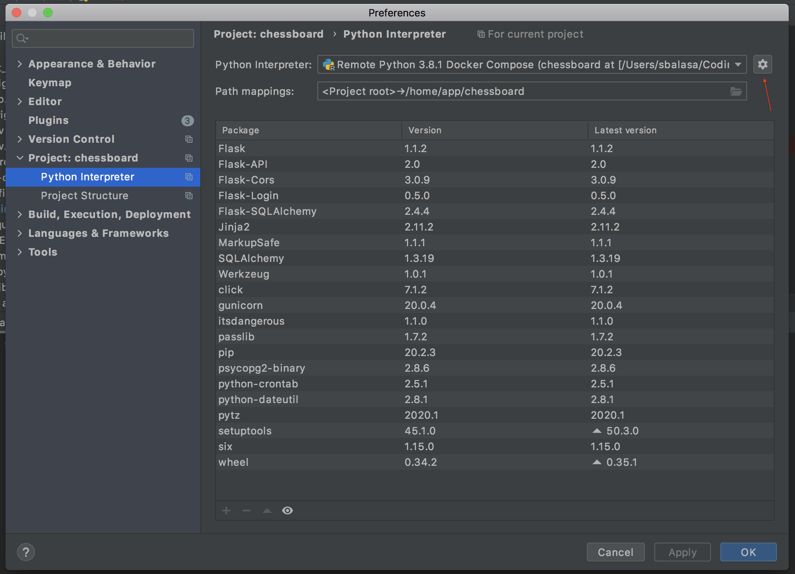
8. Fill out the form with the settings below for the interpreter and click `OK`.
   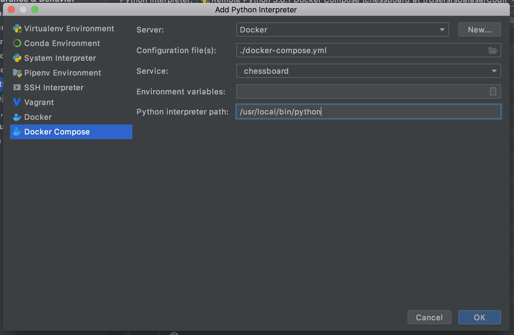
9. Click on the folder icon add the end of the `Path Mappings` field to edit path mappings.
   
10. Click the `+` icon to add a new path mapping with the settings below and click `OK`. 
    1. NOTE: Replace `Local Path` with your path to `chessboard`.
   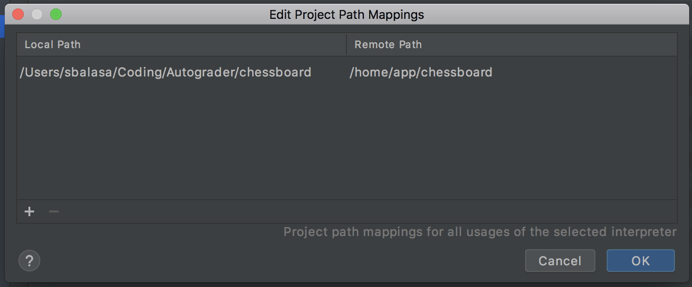
11. Your screen should look like step 7. If so, click `Apply` and `OK`.

#### Run/Debug Configuration Setup

Then we need to setup a Run/Debug Configuration for `chessboard` which "specifies details such as app installation, launch, and test options".

12. Click on the dropdown indicated below and select `Edit Configurations`.
    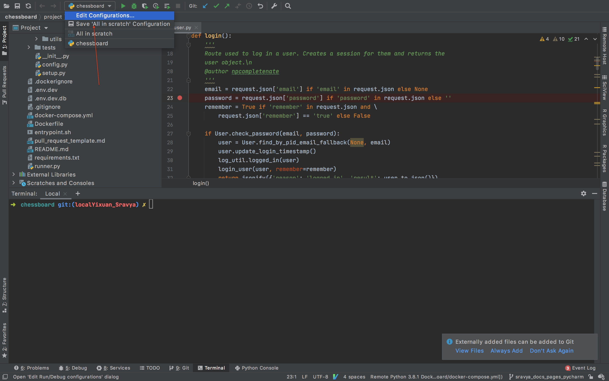
13. Click the `+` icon and select `Python` to add a Python Run/Debug Configuration.
    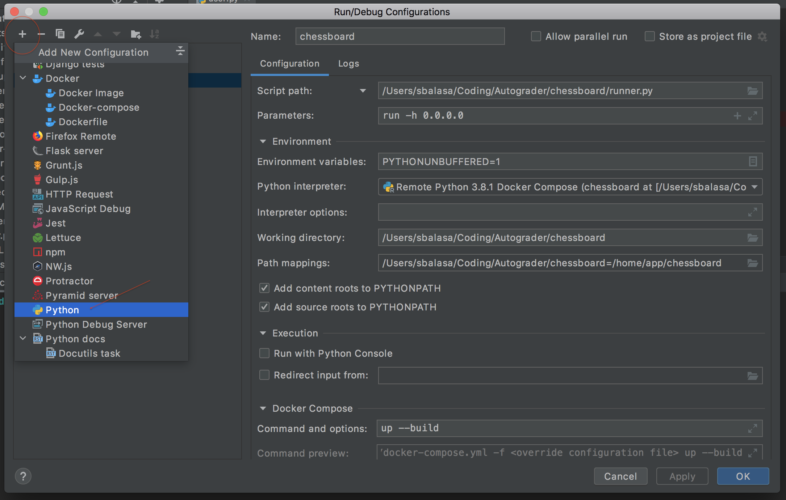
14. Fill out the form with the settings below.
    1.  NOTE: Replace `Script Path` with your local path to `runner.py`.
    2.  NOTE: Replace `Working Directory` with your local path to `chessboard`.
	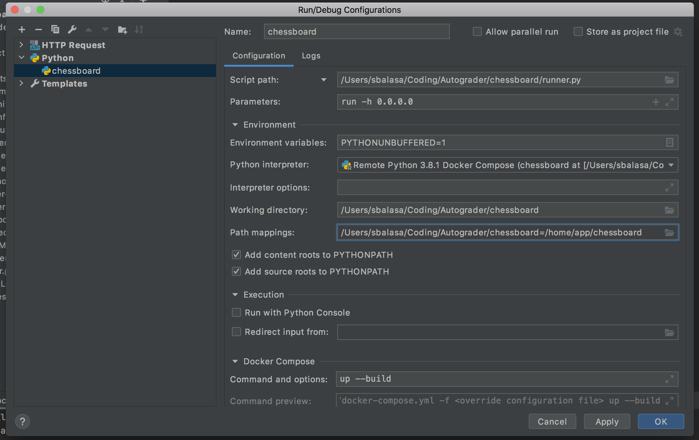
15.  Click on the folder icon add the end of the `Path Mappings` field to edit path mappings.
16. Click the `+` icon to add a new path mapping with the settings below and click `OK`. 
    1. NOTE: Replace `Local Path` with your path to `chessboard`. 
	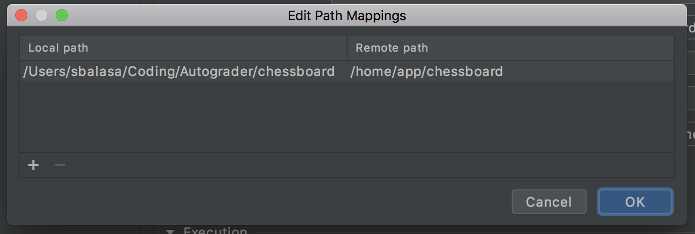
17. Your screen should look like step 14. If so, click `Apply` and `OK`.

## Using the Debugger
Check out [this link](https://www.jetbrains.com/help/pycharm/part-1-debugging-python-code.html#breakpoints) to learn how to use Pycharm's Debug tool.

18. Set breakpoints by clicking in the margin on the left side of a line number. You should see a red dot next to the line.
19. Start a debug session by clicking the debug icon. Your docker image should build.
    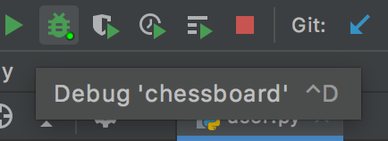
20. Stop a debug session by typing in `docker-compose down --volumes` in your terminal or clicking the stop icon.
    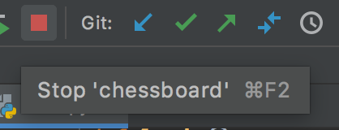
21. Here's an example of a running debug session!
    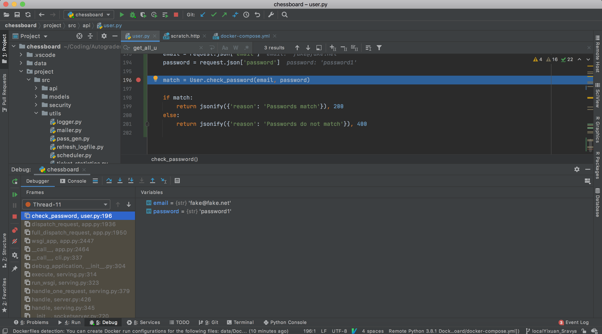 

Happy debugging!! :)
   
---
[Go back](/chessboard)
